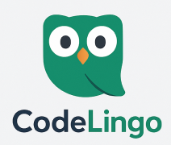

# 🧠 CodeLingo

**CodeLingo** é uma plataforma educacional gamificada para o ensino de lógica de programação. Inspirado no Duolingo, o objetivo é tornar o aprendizado divertido, progressivo e acessível para iniciantes em desenvolvimento.

---

## 📌 Visão Geral

- 🗂️ Frontend: React 
- 🖥️ Backend: Node.js com Express + Sequelize + PostgreSQL
- 🎯 Objetivo: MVP com foco em login, progresso, questões e trilhas.

---

## 🧩 Marca e Identidade Visual

| Elemento          | Detalhe                                                                 |
|-------------------|-------------------------------------------------------------------------|
| **Nome**          | CodeLingo                                                               |
| **Slogan**        | Aprenda lógica como quem joga!                                          |
| **Logo**          |                                    |
| **Cores Primárias** | `#3B82F6` (azul), `#FACC15` (amarelo), `#111827` (cinza escuro)         |
| **Fonte Principal** | Inter, sans-serif                                                     |
| **Tom de Comunicação** | Educativo, amigável, inspirador                                    |

---

## 📄 Páginas do Projeto

| Nº | Página                     | Descrição                                                                                      |
|----|----------------------------|-----------------------------------------------------------------------------------------------|
| 1  | **Início**                 | Página inicial com destaques das trilhas e chamadas para ação.                               |
| 2  | **Login**                  | Autenticação de usuários.                                                                    |
| 3  | **Cadastro**               | Criação de conta.                                                                             |
| 4  | **Painel do Usuário**      | Mostra trilhas em andamento e progresso.                                                     |
| 5  | **Perfil do Usuário**      | Edição de informações pessoais.                                                              |
| 6  | **Lista de Trilhas**       | Exibe todas as trilhas de aprendizado disponíveis.                                           |
| 7  | **Detalhe da Trilha**      | Lista as lições da trilha e progresso.                                                       |
| 8  | **Lição – Teoria**         | Página com conteúdo teórico.                                                                 |
| 9  | **Lição – Exercício**      | Questões práticas e envio de respostas.                                                      |
| 10 | **Feedback da Lição**      | Mostra desempenho, pontuação e próximos passos.                                              |
| 11 | **Histórico de Progresso** | Mostra trilhas e lições finalizadas.                                                         |
| 12 | **Ranking de Usuários**    | Gamificação com classificação por pontuação.                                                 |
| 13 | **Notificações**           | Alertas importantes.                                                                         |
| 14 | **Página de Erro 404**     | Tela para links inválidos.                                                                   |
| 15 | **Sobre o Projeto**        | Missão, equipe e contatos.                                                                   |

